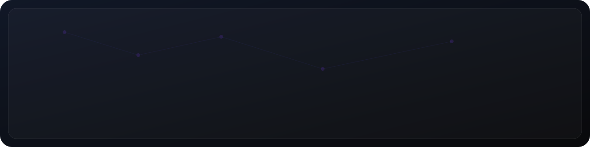
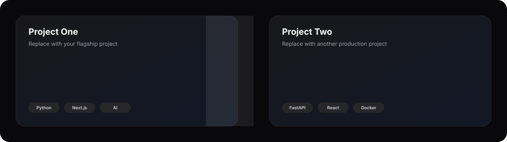
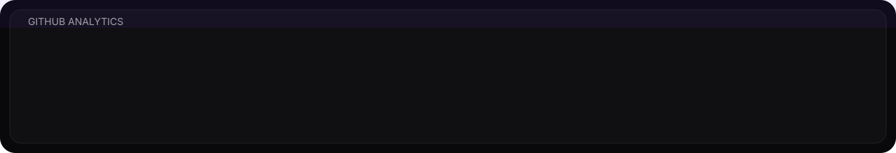

  

# Shankar K

### Full-Stack Developer • AI Engineer

Building scalable software, intelligent systems, and modern developer experiences.

---

## PROFILE

I build production-grade applications across AI, backend engineering, full-stack web development, and developer tooling. My approach prioritizes clean architecture, performance, and practical problem solving.

---

  

## TECH STACK

  

### Languages

  

### Frameworks

  

### Backend • Database • Tools

  

---

## FEATURED WORK

  

<table>
<tr>
<td width="50%">

### Project One

Brief one-line description.

`Python` `Next.js` `AI`

</td>
<td width="50%">

### Project Two

Brief one-line description.

`FastAPI` `React` `Docker`

</td>
</tr>
</table>

---

## ENGINEERING METRICS

  

  
  

  

---

## CONTRIBUTION GRAPH

  

---

## CONTRIBUTION SNAKE

  <picture>
    <source media="(prefers-color-scheme: dark)"
      srcset="https://raw.githubusercontent.com/shankark1/shankark1/output/github-contribution-grid-snake-dark.svg"/>
    
  </picture>

---

  

**Engineering software with performance, scalability, and simplicity.**

